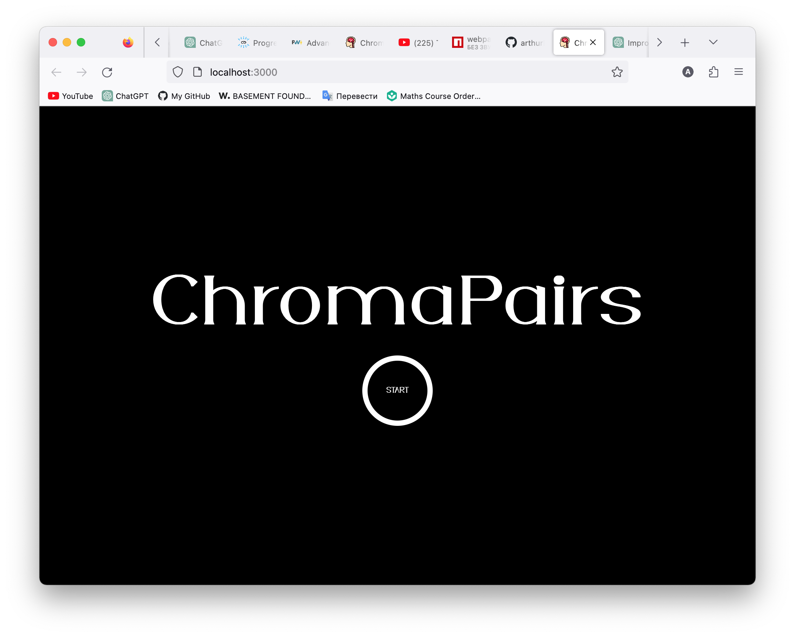

# Kottans - Memory Pair Game

This is a solution to the [Memory Pair Game by Kottans](https://github.com/kottans/frontend/blob/2022_UA/tasks/memory-pair-game.md). Kottans is an amazing FE community, check them out!

## Table of contents

-   [Overview](#overview)
    -   [The challenge](#the-challenge)
    -   [Screenshot](#screenshot)
    -   [Links](#links)
-   [My process](#my-process)
    -   [Built with](#built-with)
    -   [What I learned](#what-i-learned)
    -   [Continued development](#continued-development)
    -   [Useful resources](#useful-resources)
-   [Author](#author)

## Overview

## The challenge

1. **User Interface:**

    - Users should be able to see different screens depending on the stages of the game (start, game, and end) and navigate between them.
    - The transition of game stage screens should have correct and consistent animations.

2. **Button Interactions:**

    - Users should see correct animations when hovering over and pressing the game and start buttons.
    - Clicking on the game button should display its corresponding color.
    - Users should be able to cancel their choice by clicking on a previously selected button again.
    - After selecting the first button, users should be able to press the second button and pass the color matching test.
    - If the match is confirmed, users' points should be credited, and the buttons should remain open. If not, the buttons should return to the previous closed state.
    - Users should not be able to press any game button while two pre-selected game buttons that have not passed the matching test remain open.
    - Different button animations should be visible to users based on whether their choices comply with the requirements or not.
    - Users should not be able to interact with the buttons that have passed the check.

3. **Game Flow:**

    - Users should be able to finish the game if all pairs are collected.
    - At the end of the game, users should see a screen displaying the results of their game, including the total number of moves and the time spent on finding all the pairs.
    - Users should be able to view their previous best score for both indicators. If the current game is their best, a notification should indicate it.
    - Users should have the option to start the game again after it ends without having to reload the browser tab.

4. **Additional Features:**
    - The game should be set as a Progressive Web App (PWA) for enhanced functionality.
    - Users should be able to view an optimal layout for the interface depending on their device's screen size.

### Screenshot



### Links

-   [Live Site](https://app.netlify.com/sites/stupendous-cranachan-107ee2/overview)

## My process

### Built with

-   Semantic HTML5 markup
-   CSS Grid
-   [SCSS](https://sass-lang.com/) - CSS Preprocessor
-   [XState](https://xstate.js.org/) - library for handling finite state machines and statecharts
-   [Anime.js](https://animejs.com/) - JS animation library
-   [Webpack](https://webpack.js.org/) - Module bundler
-   [Chroma.js](https://gka.github.io/chroma.js/) - small JS library for color manipulations
-   [PostCSS](https://postcss.org/) - A tool for transforming CSS with JavaScript
-   [Babel](https://babeljs.io/) - JS compiler for next generation features

### What I learned

This project proved to be quite challenging for me, as I worked on a variety of functions that kept me busy. The main difficulty I encountered was understanding the complex structure of the application's different stages during runtime. To overcome this, I found great help in the XState library, which assisted me in managing the application's logic and ensuring the correct sequence of actions. Using this library effectively required me to delve deep into its principles and understand the concept of state management from the ground up. This involved spending long hours reading the documentation, but it was worth it as I was able to create a stable model of the application's possible states and the actions allowed in each state. For example, I focused on implementing the gameplay structure, logic, and actions performed at different moments during the application's execution.

<details>
<summary>Game logic finite states</summary>

```js
states: {
                zeroCardOpened: {
                    on: {
                        COLOR_CLICKED: {
                            target: 'oneCardOpened',
                            actions: [
                                'updateFirstCard',
                                'changeCardColor',
                                'changeTwoCardOpenedVarToFalse',
                                'increaseTotalMoves',
                            ],
                        },
                    },
                },
                oneCardOpened: {
                    on: {
                        COLOR_CLICKED: [
                            {
                                cond: 'clikedTheSameCard',
                                target: 'zeroCardOpened',
                                actions: ['resetChosenCards'],
                            },
                            {
                                target: 'twoCardOpened',
                                actions: [
                                    'updateSecondCard',
                                    'changeCardColor',
                                ],
                            },
                        ],
                    },
                },
                twoCardOpened: {
                    always: [
                        {
                            cond: 'pairIsCorrect',
                            target: 'allPairsFoundCheck',
                            actions: ['increasePairsFound'],
                        },
                        {
                            cond: 'pairIsNotCorrect',
                            target: 'zeroCardOpened',
                            actions: [
                                'resetChosenCards',
                                'changeTwoCardOpenedVarToTrue',
                            ],
                        },
                    ],
                },
                allPairsFoundCheck: {
                    always: [
                        {
                            cond: 'allPairsFoundCond',
                            target: 'allPairsFound',
                            actions: ['freezeChosenCards'],
                        },
                        {
                            target: 'zeroCardOpened',
                            actions: ['freezeChosenCards'],
                        },
                    ],
                },
```

</details>

Working with the anime.js library presented unexpected difficulties for me, especially when dealing with a large number of animations. It was important to ensure that the animations didn't overlap and ran in the intended sequence. Through this project, I learned how to create animations in JavaScript, and I believe that there are endless possibilities for their application. I had to fix several bugs in my custom implementation of button animations, such as hover and click effects. In addition to maintaining the overall timeline, I had to pay attention to small details, like how the buttons behaved when the mouse was clicked inside the button and then moved outside of its area.

<details>
<summary>Mouseleave animation handler</summary>

```js
elementBtn.addEventListener(
        'mouseleave',
        () => {
            ...
            // Check if the mouse was pressed when leaving the element
            // If so, animate the button's return to its previous state
            if (mouseDown) {
                hoverAnimation(innerElementBtn, innerBtnSize, 800, 0);
            }
            hoverAnimation(elementBtn, 1.0, 600, 300);
        },
        false
    );
```

</details>

This project also introduced me to Webpack, a modular bundler, for the first time. Understanding and configuring this tool was not easy due to the many plugins, loaders, and additional functions involved. However, I managed to overcome the initial confusion and successfully set up the project, including the server and build process. Setting up Progressive Web App (PWA) functionality with Webpack was particularly challenging, as I had no prior experience with it. Eventually, I used the Workbox plugin, which made the task easier, although it still had its challenges.

Overall, this is the largest project I have worked on to date. Throughout its development, I gained valuable experience in writing and debugging code, as well as understanding the logic behind various functions.

### Continued development

During the course of this project, I have identified several areas that I would like to continue focusing on and improving in future projects. These areas include:

1. **Advanced State Management**: While I have gained a solid understanding of state management principles, I am keen to further explore and utilize more advanced state management techniques and libraries to enhance the efficiency and scalability of my applications.

1. **Optimizing Animations**: Although I successfully implemented animations using the anime.js library, I recognize the need to optimize and fine-tune animation performance. Going forward, I plan to explore techniques such as hardware acceleration, utilizing requestAnimationFrame for smoother animations, and optimizing animation sequences to achieve better overall performance.

1. **Refining Webpack Configuration**: Working with Webpack was a valuable learning experience, but there is still room for improvement. In future projects, I aim to deepen my knowledge of Webpack configuration and explore advanced features such as code splitting, tree shaking, and caching, to optimize bundle size and improve application loading speed.

1. **Testing and Quality Assurance**: While I ensured the stability and functionality of this project, I want to strengthen my skills in writing comprehensive unit tests and implementing automated testing workflows. By incorporating testing frameworks and methodologies, I aim to improve the reliability and maintainability of my code.

1. **Accessibility and PWA Enhancements**: In future projects, I plan to prioritize accessibility considerations from the start and ensure that my applications are usable by a wider range of users. Additionally, I aim to further enhance Progressive Web App (PWA) features, such as offline capabilities and push notifications, to provide a more seamless and engaging user experience.

### Useful resources

-   [DeltaE](zschuessler/DeltaE) - Amazing github repository with reliable and accurate color difference algorithms.
-   [State Machines in JavaScript with XState, v2](https://frontendmasters.com/courses/xstate-v2/) - Exelent course on XState, led by a creator of a library.
-   [Webpack - Полный курс за 3 часа](https://www.youtube.com/watch?v=eSaF8NXeNsA) - Great and easy-going tutorial on webpack
-   [Moving Letters](https://tobiasahlin.com/moving-letters/) - Big and easy to use anime.js library with interesting title entrances
-   [Build A PWA With Webpack And Workbox](https://www.smashingmagazine.com/2019/06/pwa-webpack-workbox/) by Jad Joubran - Very detailed article on the theme of WorkBox PWA configuration with WebPack
-   [Excalidraw](https://excalidraw.com/) - Vizualization tool for preety much everything with very interesting style. It helped me a lot in vizualization of the structure of my xState machine

## Author

-   Telegram - [@yazdrahobycha](https://t.me/yazdrahobb)
